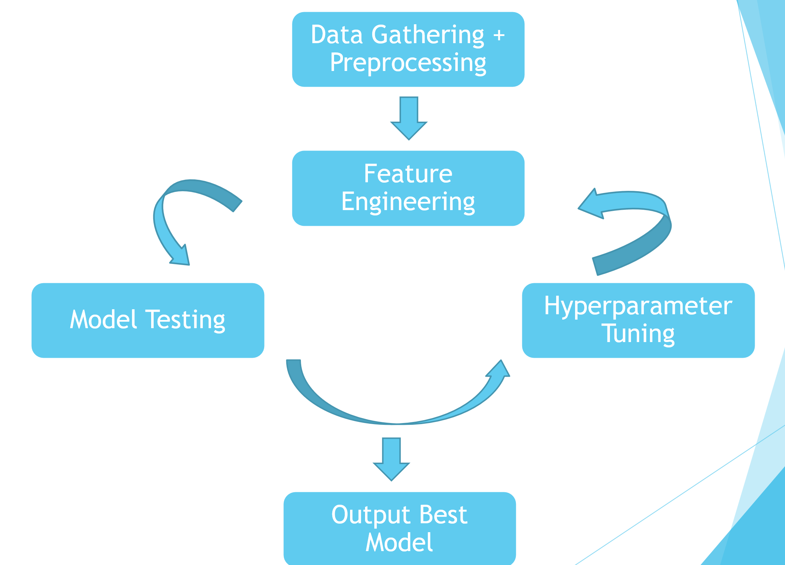
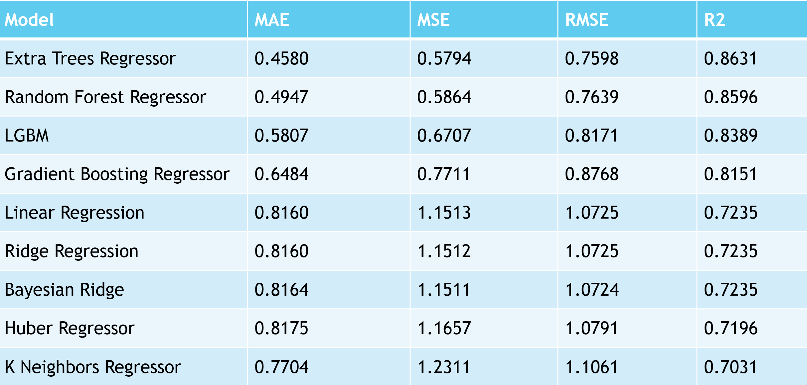

# Solubility Project
&nbsp;
## Intro/Goal
The goal of this project was to predict the solubility of a molecule based on features engineered from it's molecular structure. Aqueous solubility is an important property in drug discovery/creation as it is essential to achieve the desired concentration of a drug in systemic circulation. 
&nbsp;

## Workflow

&nbsp;

Data was gathered from various research papers and combined into a single dataset, molecular structure was standardized to SMILES notation and features engineered were engineered from SMILES notation using rdkit.

## Features
* MollogP
* Avg Mol Weight
* Num Rotatable Bonds
* Num Aromatic Atoms
* Num Heavy Atoms
* Aromatic Proportion
* Num Valence Electrons
* Exact Mol Weight
* Heavy Atom Weight
* Labute's Approximate Surface Area

## Results

&nbsp;

Above are the results for the 10 best performing models. The extra trees regressor model performed the best with an r2 score of 0.8631.

## Organization
* data --> Contains raw and processed data for the project
* src --> Contains 5 notebooks detailing the steps for the project as well as a pickle file of the Extra Trees Regressor model